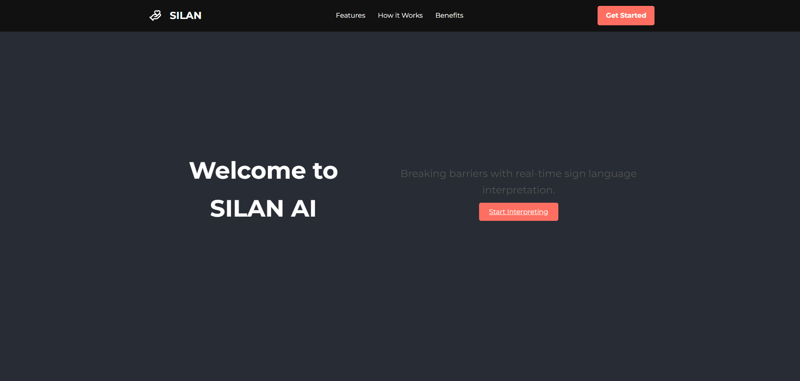

# 🤟 SILAN AI - Real-Time Sign Language Detection

Welcome to **SILAN AI**, a real-time sign language detection system that converts hand gestures into readable text (and optionally audio). The project harnesses the power of deep learning and computer vision to bridge the communication gap between the hearing-impaired and the rest of the world.

---

## 🌟 Features

- 🔤 Real-time recognition of sign language alphabets
- 🎥 Live webcam feed integration
- 🧠 Deep Learning-based prediction model
- 🔈 Optional voice output for recognized gestures
- 💻 Clean and simple user interface

---

## 🛠️ Tech Stack

- **Frontend:** HTML, CSS
- **Backend:** Python (Flask)
- **AI/ML:** TensorFlow/Keras or PyTorch
- **Computer Vision:** OpenCV
- **Others:** NumPy, JavaScript

---

## 📂 Project Structure

```
SILAN-AI/
│
├── model/                              # Final chosen model for deployment
│   └── model.h5                        # Trained DL model (used in real-time detection)
│
├── static/
│   └── style.css                       # Frontend styling
│
├── templates/
│   └── index.html                      # Webpage template (Flask)
│
├── Dataset/                            # Image dataset organized in subfolders by class
│
├── Models/                             # Trained deep learning models
│   ├── cnn_model.h5
│   ├── convlstm_model.h5
│   ├── resnet50_model.h5
│   └── vgg16_model.h5
│
├── Notebooks/                          # Jupyter notebooks for development & training
│   ├── app.ipynb                       # Flask web app code
│   ├── Models used.ipynb              # Model training & comparison notebook
│   └── Real Time Detection.ipynb      # Real-time webcam-based sign detection
│
├── preview.png                         # Screenshot of the web app
├── requirements.txt                    # Required Python packages
└── README.md                           # Project overview & instructions

```
---

## 💡 How It Works

1. User shows a sign inside the webcam box.
2. The model processes the frame and identifies the hand gesture.
3. The predicted character is displayed on the screen.
4. Optional: Text is converted into speech for better accessibility.

---

## ⚙️ How to Run Locally

```bash
# Clone this repo
git clone https://github.com/yourusername/SILAN-AI-Sign-Language-Detection.git
cd SILAN-AI-Sign-Language-Detection

# Create and activate virtual environment
python -m venv venv
source venv/bin/activate  # On Windows use: venv\Scripts\activate

# Install dependencies
pip install -r requirements.txt

# Run the app
python app.py
```

Then, open your browser and navigate to:  
👉 `http://127.0.0.1:5000`

---

## 🧪 Sample Preview



---

## 📋 Requirements

Add this to your `requirements.txt`:

```
Flask
opencv-python
numpy
tensorflow      # or torch if using PyTorch
```

---

## 🙌 Contribution

Want to improve or extend the app? Feel free to fork the repository and submit a PR. Contributions are welcome!

---

## 📄 License

This project is licensed under the MIT License - do whatever you want with proper attribution.

---

## 🙋‍♂️ Made by

**Santhosh VS**  
[GitHub](https://github.com/Itssanthoshhere) | [LinkedIn](https://linkedin.com/in/thesanthoshvs)

---

